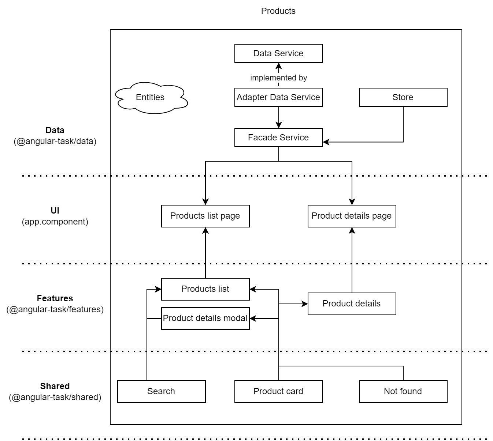
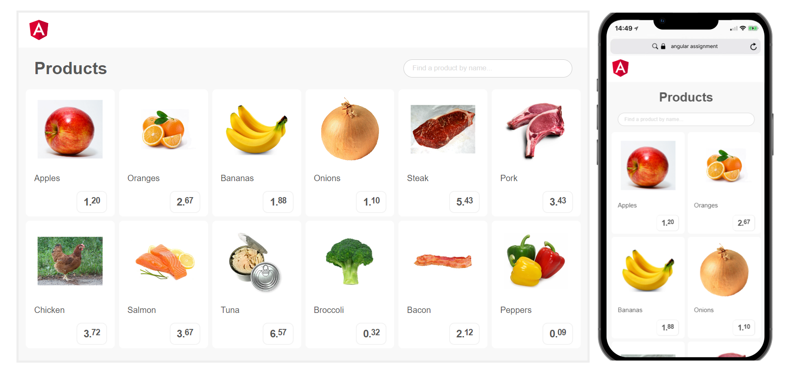
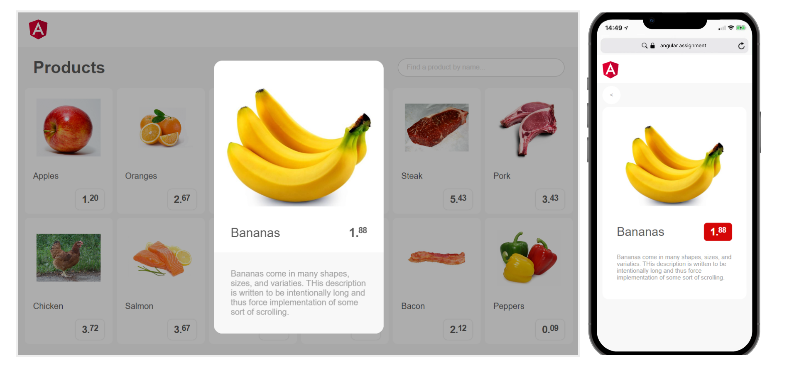

## Description ##

### Initial requirements ###

The task is to create a small SPA that does the following:

1. A list of products is retrieved from a REST endpoint.
2. This list of products is displayed using a responsive Grid with the following requirements:

   * URL: `/list`
   * Mobile device: 2 items per row
   * Tablet device: 3 items per row
   * Desktop: 6 items per row

3. Each product item contains the following information:

   * Name
   * Price
   * Image

4. The list of products can be filtered, by typing a query in a text field at the top of the list.
5. A product container is a clickable / tappable element, which has the following logic:

   * If the user is on mobile device, it redirects to a separate view with product details. URL: `/list/details/productID`
   * If the user is on desktop, it triggers a “popup” view with product details.

6. The details of the clicked product are retrieved from a REST endpoint as well.
7. A User can also access product pages on the desktop directly by going to `/list/details/productID`

### Implementation ###

_**Tech stack**: Angular 14, Angular CDK, SCSS, Jest_

The outcome implementation doesn't have any additional dev dependencies (such as State-management, Design System etc.)
as I tried to keep it as simple as possible.
Also, I've added Jest for covering code with tests but unfortunately didn't have enough time to do this :(

In a real growing project I would also use:

* monorepo (e.g. [Nx](https://github.com/nrwl/nx)) for splitting the logic into separate projects, having better scaling
  experience and other perks;
* some Redux-like state-management library (e.g. [Elf](https://github.com/ngneat/elf)
  / [Akita](https://github.com/salesforce/akita) / [NgRx](https://github.com/ngrx/platform), depends on project business
  requirements);
* design system to ensure style consistency;
* code-checking tools (Prettier, ESLint etc.) to keep it clean and safe;
* and much, much more :)

### Architecture ###

As for app architecture, I instantly thought of picking something feature-oriented and split into layers (e.g.
Feature-sliced, but existing patterns are designed for large-scale applications, and they're pretty complex), and also
using SOLID principles.

That's why I decided to do it myself and came up with this simplified but convenient structure:

This structure consists of the following layers:

1. **Data**. The whole application depends on the logic of this data layer. It basically dictates the way data is
   organized and managed.
2. **UI**. Contains all the features and represents the whole interface of the app. Communicates with the Data layer
   using Facade service.
3. **Features**. Set of smart components. The main building block of the UI.
4. **Shared**. Just a set of dumb components for building new features.

I also decided not to split these layers into separate projects, but split them between different folders and modules in
the scope of only one Angular project workspace (just to not over-engineer it). But if you do so then you will be able
to get a new project (i.e. package) for every new feature. New package might become an isolated part of one of the
presented layers.

Generally speaking, this design allows you to write extensible, well-structured and efficient code.
It can be easily applied both to such a small application and to a larger one.
But I think for larger projects you have to go with a more complex architecture.

That's it. Thanks!

### Screenshots ###

